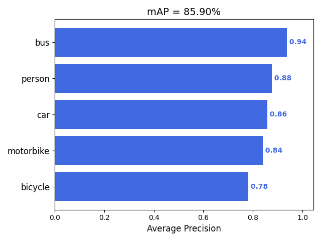

# TogetherNet: Bridging Image Restoration and Object Detection Together via Dynamic Enhancement Learning

We provide our PyTorch implementation for paper "TogetherNet: Bridging Image Restoration and Object Detection Together via Dynamic Enhancement Learning". 


## Prerequisites
Python 3.6 or above.

For packages, see requirements.txt.

### Getting started


- Install PyTorch 1.6 or above and other dependencies (e.g., torchvision, visdom, tqdm, Pillow).

  For pip users, please type the command `pip install -r requirements.txt`.

  For Conda users,  you can create a new Conda environment using `conda env create -f environment.yml`.
  
### TogetherNet Training and Test

- Train the UCL-Dehaze model:
```bash
python train.py 
```
The checkpoints will be stored at `./logs`.

- Calculate the mAP:
```bash
python get_map.py
```
The test results will be saved here: `./map_out`.

- infer the images (choose dir_predict mode):
```bash
python predict.py
```
The test results will be saved here: `./img_out`.

### Detection Results
VOC-FOG-test:



Foggy Driving Dataset:


RTTS:


### Acknowledgments
Our code is developed based on [yolox-pytorch](https://github.com/bubbliiiing/yolox-pytorch) and [YOLOX](https://github.com/Megvii-BaseDetection/YOLOX). We thank the awesome work provided by bubbliiiing and Megvii.
And great thanks to the anonymous reviewers for their helpful feedback.

