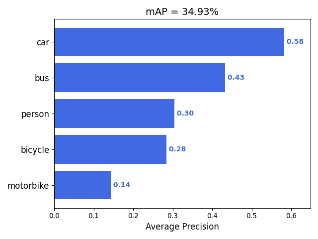

# TogetherNet: Bridging Image Restoration and Object Detection Together via Dynamic Enhancement Learning (PG & CGF'2022)

Authors: Yongzhen Wang, Xuefeng Yan, Kaiwen Zhang, Lina Gong, Haoran Xie, Fu Lee Wang, Mingqiang Wei

[[Paper Link]](https://diglib.eg.org/handle/10.1111/cgf14692) 

### Abstract

Adverse weather conditions such as haze, rain, and snow often impair the quality of captured images, causing detection networks trained on normal images to generalize poorly in these scenarios. In this paper, we raise an intriguing question - if the combination of image restoration and object detection, can boost the performance of cutting-edge detectors in adverse weather conditions. To answer it, we propose an effective yet unified detection paradigm that bridges these two subtasks together via dynamic enhancement learning to discern objects in adverse weather conditions, called TogetherNet. Different from existing efforts that intuitively apply image dehazing/deraining as a pre-processing step, TogetherNet considers a multi-task joint learning problem. Following the joint learning scheme, clean features produced by the restoration network can be shared to learn better object detection in the detection network, thus helping TogetherNet enhance the detection capacity in adverse weather conditions. Besides the joint learning architecture, we design a new Dynamic Transformer Feature Enhancement module to improve the feature extraction and representation capabilities of TogetherNet. Extensive experiments on both synthetic and real-world datasets demonstrate that our TogetherNet outperforms the state-of-the-art detection approaches by a large margin both quantitatively and qualitatively. Source code is available at https://github.com/yz-wang/TogetherNet.

#### If you find the resource useful, please cite the following :- )

```
@article {10.1111:cgf.14692,
journal = {Computer Graphics Forum},
title = {{TogetherNet: Bridging Image Restoration and Object Detection Together via Dynamic Enhancement Learning}},
author = {Wang, Yongzhen and Yan, Xuefeng and Zhang, Kaiwen and Gong, Lina and Xie, Haoran and Wang, Fu Lee and Wei, Mingqiang},
year = {2022},
publisher = {The Eurographics Association and John Wiley & Sons Ltd.},
ISSN = {1467-8659},
DOI = {10.1111/cgf.14692}
}
```  

## Prerequisites
Python 3.6 or above.

For packages, see requirements.txt.

### Getting started


- Install PyTorch 1.6 or above and other dependencies (e.g., torchvision, visdom, tqdm, Pillow).

  For pip users, please type the command `pip install -r requirements.txt`.

  For Conda users,  you can create a new Conda environment using `conda env create -f environment.yml`.
  
## VOC-FOG Dataset

- Our VOC-FOG dataset is available at:
1. Baidu Netdisk: https://pan.baidu.com/s/1lQXSuqdpjPTMHMvky4TIVQ        
Code: tvyz

2. Google Drive: coming soon.
  
### TogetherNet Training and Test

- Train the TogetherNet model:
```bash
python train.py 
```
The checkpoints will be stored at `./logs`.

- Calculate the mAP:
```bash
python get_map.py
```
The test results will be saved here: `./map_out`.

- infer the images (choose dir_predict mode):
```bash
python predict.py
```
The test results will be saved here: `./img_out`.

### Detection Results
VOC-FOG-test:


Foggy Driving Dataset:



RTTS:


### Acknowledgments
Our code is developed based on [yolox-pytorch](https://github.com/bubbliiiing/yolox-pytorch) and [YOLOX](https://github.com/Megvii-BaseDetection/YOLOX). We thank the awesome work provided by bubbliiiing and Megvii.
And great thanks to the anonymous reviewers for their helpful feedback.

## Contact

If you have questions, you can contact `wangyz@nuaa.edu.cn`.
